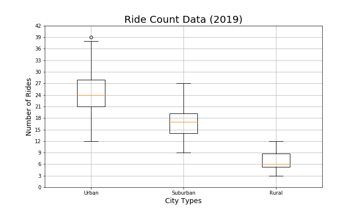
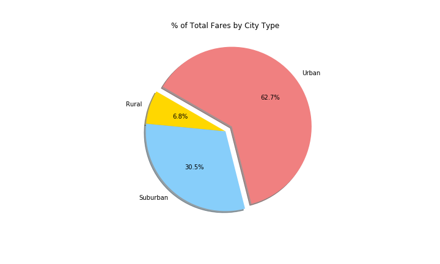
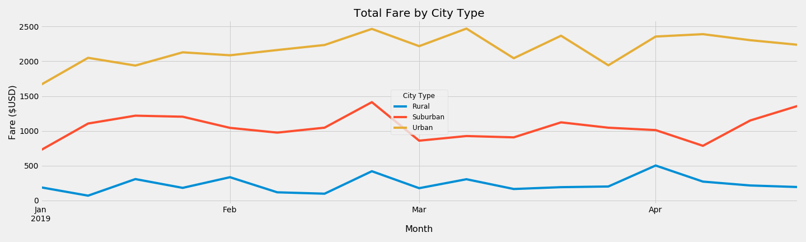

# PyBer Analysis

## Project Overview
A Python-based ride sharing app needs analysis on the company's profits and customer demographics. With two data files, one of city dataand one of ride data, ther following deliverables are needed:
- A bubble chart that showcases the average fare versus the total number of rides with bubble size based on the total number of drivers for each city type
- The mean, median, and mode for the following:
	+ The total number of rides for each city type.
	+ The average fares for each city type.
	+ The total number of drivers for each city type.
- Box-and-whisker plots that visualize each of the following to determine if there are any outliers:
	+ The number of rides for each city type.
	+ The fares for each city type.
	+ The number of drivers for each city type.
- A pie chart that visualizes each of the following data for each city type:
	+ The percent of total fares.
	+ The percent of total rides.
	+ The percent of total drivers.

## Resources
Data Sources: 
- city_data.csv
- ride_data.csv

Software:
- Python 3.7.4
- Pandas 0.25.2
- Matplotlib 3.1.1

## Summary

*See PyBer.ipynb for summary statistics*

## Challenge Overview
Need to create an overall snapshot of the ride-sharing data. In addition to the scatter and pie charts, a summary table of key metrics of the ride-sharing data by city type and a multiple-line graph that shows the average fare for each week by each city type are required.

## Challenge Summary

**Summary DataFrame**  
The datashows that urban cities do significantly more business than suburban or rural cities based on the the 4-10x number of rides and 5-30x number of drivers in urban cities compared to rural and suburban ones. It's also interesting to note that the average fares are the lowest for drivers and ride in urban cities. This shows that trips are shorter/cost less in urban areas and that due to the high number of drivers, each employee makes less on average in urban cities compared to rural or suburban ones. 

**Multiple-line Graph**  
The graph shows a very consistent trend across the different city types. Urban cities consistently bring in the most money, followed by suburban ones, and finally rural cities. The plots vaguely mirror eachother with all three dropping their total fares in March before peaking mid-late February. 

**Implications**  
The line graph clearly shows the different brackets of each city type's total fares. There are no parts of the graph close to intersection. However, the lines do follow similar trends through time which reflects the similarities between city types despite the total fares being different magnitudes.

